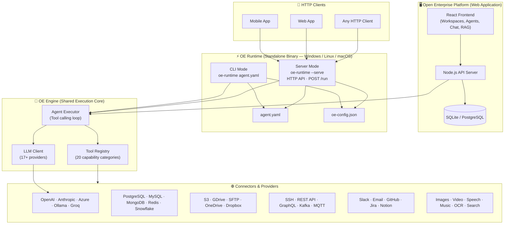

<div align="center">

<h1>Open Enterprise</h1>
<h3>Enterprise AI Platform &amp; Agent Runtime · Apache-2.0 · Self-Hosted</h3>

**A self-hosted AI agent runtime built on declarative YAML agents.**
No LangChain. No LangGraph. No code. Run agents anywhere with a single binary.

[](LICENSE)
[](https://hub.docker.com/r/openenterprise/open-enterprise-community)
[](https://github.com/openenterprise-info/open-enterprise-community/releases)
[](https://github.com/openenterprise-info/open-enterprise-community/releases/latest/download/oe-runtime-win.exe)
[](https://github.com/openenterprise-info/open-enterprise-community/releases/latest/download/oe-runtime-linux)
[](https://github.com/openenterprise-info/open-enterprise-community/releases/latest/download/oe-runtime-macos)
[Website](https://www.openenterprise.info) · [OE Runtime](https://www.openenterprise.info/runtime.html) · [Docker Hub](https://hub.docker.com/r/openenterprise/open-enterprise-community)

</div>

---

## What is Open Enterprise?

Open Enterprise is an **open-source enterprise AI platform** and **self-hosted AI agent runtime** that lets you build and run autonomous AI agents without writing code. Define complex, multi-step agentic AI workflows in plain YAML. Connect 2,673 enterprise tools — databases, APIs, cloud storage, messaging, SSH, IoT — without custom integration code.

- **No LangChain. No LangGraph. No Python.** Agents are declarative YAML files.
- **Run agents anywhere.** OE Runtime is a single binary for Windows, Linux, and macOS. No Node.js, no Docker, no install.
- **Self-hosted AI.** Deploy on your own infrastructure. Own your data completely. No call-home.
- **Human approval gates.** Build human-in-the-loop agentic workflows without writing code.
- **Enterprise-ready.** Multi-workspace, RAG, MCP, DLP governance, and 2,673 connectors out of the box.

---

## Table of Contents

- [Architecture](#architecture)
- [OE Runtime — Single Binary Agent Executor](#oe-runtime--single-binary-agent-executor)
- [Open Enterprise Platform](#open-enterprise-platform)
- [Quick Start](#quick-start)
- [Writing Agents](#writing-agents)
- [Agent Examples](#agent-examples)
- [Connector Catalog](#connector-catalog)
- [Feature Capabilities](#feature-capabilities)
- [Runtime vs Platform](#runtime-vs-platform)
- [Comparison](#comparison)
- [Environment Variables](#environment-variables)
- [Roadmap](#roadmap)
- [Contributing](#contributing)
- [Community](#community)
- [License](#license)

---

## Architecture

Open Enterprise has two deployment modes — the **Platform** (full web application) and the **Runtime** (standalone CLI binary). Both share the same underlying agent execution engine.



---

## OE Runtime — Single Binary Agent Executor

OE Runtime is a standalone, cross-platform agent executor. No server. No database. No Node.js install required. Point it at a YAML agent file and run.

### Download

| Platform | Binary | Size |
|----------|--------|------|
| **Windows** | [oe-runtime-win.exe](https://github.com/openenterprise-info/open-enterprise-community/releases/latest/download/oe-runtime-win.exe) | ~141 MB |
| **Linux** | [oe-runtime-linux](https://github.com/openenterprise-info/open-enterprise-community/releases/latest/download/oe-runtime-linux) | ~179 MB |
| **macOS** | [oe-runtime-macos](https://github.com/openenterprise-info/open-enterprise-community/releases/latest/download/oe-runtime-macos) | ~167 MB |
| **Config template** | [oe-config.example.json](https://github.com/openenterprise-info/open-enterprise-community/releases/latest/download/oe-config.example.json) | — |
| **Sample agent** | [agent.example.yaml](https://github.com/openenterprise-info/open-enterprise-community/releases/latest/download/agent.example.yaml) | — |
| **Postman collection** | [oe-runtime.postman_collection.json](https://github.com/openenterprise-info/open-enterprise-community/releases/latest/download/oe-runtime.postman_collection.json) | — |

> Links always point to the **latest release**. Binaries are built automatically via GitHub Actions on every version tag across all three platforms simultaneously.

### Usage

```bash
# Run an agent
oe-runtime agent.yaml --config oe-config.json

# Pass parameters
oe-runtime market-report.yaml \
  --config oe-config.json \
  --param company="Tesla" \
  --param recipient="ceo@company.com"

# Pass an input message
oe-runtime researcher.yaml \
  --config oe-config.json \
  --input "Summarise AI trends in healthcare Q3 2026"

# Start as an HTTP API server (new in v1.3.3)
oe-runtime --serve --config oe-config.json

# Show help
oe-runtime --help
```

### Config File

Copy `oe-config.example.json` → `oe-config.json` and fill in your credentials:

```json
{
  "llm": {
    "provider": "openai",
    "apiKey": "sk-...",
    "model": "gpt-4o"
  },
  "connectors": [
    {
      "connection_name": "My Database",
      "connection_type": "postgres",
      "host": "localhost",
      "port": 5432,
      "user": "postgres",
      "password": "...",
      "database": "mydb"
    },
    {
      "connection_name": "Perplexity Search",
      "connection_type": "perplexity-search",
      "apiKey": "pplx-..."
    },
    {
      "connection_name": "Company Email",
      "connection_type": "smtp",
      "host": "smtp.zoho.com",
      "port": 465,
      "secure": true,
      "user": "you@yourcompany.com",
      "pass": "..."
    }
  ]
}
```

`connection_name` in the config must match `connection_name` in the agent YAML — that is how the runtime links credentials to connectors.

Supported LLM providers: `openai`, `anthropic`, `azure`, `groq`, `gemini`, `ollama`, `mistral`, `deepseek`, `together`, `fireworks`, and more.

### HTTP Server Mode

Add `--serve` to turn OE Runtime into a persistent HTTP API server. Call agents from mobile apps, web services, scripts, or any HTTP client — no Node.js or Docker needed on the client side.

```bash
oe-runtime --serve --config oe-config.json
# 🚀  OE Runtime Server  v1.3.3
# Listening  http://localhost:3333
```

| Endpoint | Method | Description |
|----------|--------|-------------|
| `/health` | `GET` | Liveness check — returns `{ status, version }` |
| `/run` | `POST` | Run an agent from an inline YAML string |
| `/run-file` | `POST` | Run an agent from a YAML file path on disk |

**Example — POST /run:**

```bash
curl -X POST http://localhost:3333/run \
  -H "Content-Type: application/json" \
  -H "x-api-key: your-secret-key" \
  -d '{
    "yaml": "name: Hello\nsteps:\n  - name: Answer the question",
    "input": "What is 2 + 2?"
  }'
```

```json
{ "success": true, "output": "2 + 2 equals 4.", "duration_ms": 1823 }
```

**Optional auth** — set `server.apiKey` in `oe-config.json` to protect all endpoints with an `x-api-key` header. Set `server.port` to change from the default `3333`.

```json
{
  "llm": { "provider": "openai", "apiKey": "sk-...", "model": "gpt-4o" },
  "server": { "port": 3333, "apiKey": "your-secret-key" },
  "connectors": [ ... ]
}
```

### Runtime Capability Categories

| Category | Providers / Protocols |
|----------|-----------------------|
| SQL Databases | PostgreSQL, MySQL, MSSQL, Oracle, SQLite, Snowflake, BigQuery, Redshift |
| NoSQL & Cache | MongoDB, Redis, Elasticsearch |
| Object Storage | AWS S3, GCS, Azure Blob, MinIO, Cloudflare R2, Backblaze B2 |
| Cloud Drives | Google Drive, OneDrive, SharePoint, Dropbox, Box |
| Email | Gmail, Zoho Mail, SMTP, IMAP |
| Messaging | Slack |
| SSH | Any Linux / Unix / Windows server (password or private key) |
| REST API & HTTP | Any HTTP endpoint, custom headers, Bearer / API key / Basic auth |
| GraphQL | GraphQL, Hasura, GraphCMS, Fauna |
| Productivity & CRM | GitHub, Jira, Notion, Confluence, HubSpot, Freshdesk, Zendesk |
| Message Queues | Kafka, RabbitMQ, AWS SQS, Azure Service Bus, Google Pub/Sub |
| Web Search | Perplexity, Google Custom Search, Bing |
| OCR / Vision | Azure Vision, Google Vision, AWS Textract, Tesseract |
| Image Generation | OpenAI gpt-image-1, FLUX, Stable Diffusion, Ideogram |
| Speech & Audio | ElevenLabs, OpenAI TTS, Azure Speech, Google TTS |
| Video Generation | Runway, Kling, Pika (async job polling included) |
| Music Generation | Suno, Udio (async job polling included) |
| Blockchain / Web3 | Ethereum, Polygon, Solana, Avalanche, Infura, Alchemy |
| Directory & Identity | LDAP, Active Directory, Azure AD, OpenLDAP |
| IoT Messaging | MQTT, AWS IoT, HiveMQ, Mosquitto |

---

## Open Enterprise Platform

The full web application — multi-workspace, multi-user, multi-LLM. Deploy once, use across your entire organization.

```bash
docker run -d \
  -p 3001:3001 \
  -e JWT_SECRET=your-secret \
  -e SUPER_ADMIN_EMAIL=admin@yourdomain.com \
  -e SUPER_ADMIN_PASSWORD=your-password \
  -v ./data:/app/server/storage \
  openenterprise/open-enterprise-community:latest
```

Open [http://localhost:3001](http://localhost:3001) and log in with your super admin credentials. Configure your LLM provider, embedding model, and vector database from the admin panel — no `.env` changes needed.

### Platform Capabilities

| Feature | Description |
|---------|-------------|
| **AI Assistant / Chat** | SSE streaming chat with RAG, tool calling, @connector and @agent routing |
| **Workspaces** | Multi-tenant workspaces with per-workspace LLM, embedding, and vector DB overrides |
| **RBAC** | Role-based access control — admin, member, viewer per workspace |
| **Agent Builder** | Conversational YAML designer with visual flow and step validation |
| **Marketplace** | Browse and deploy community agent templates (Security, Sales, Marketing, DevOps, Analytics) |
| **Agent Chains** | Sequential agent execution with `always / on_success / on_critical / on_warning` conditions |
| **Cron Scheduling** | Schedule any agent on a cron expression |
| **RAG** | Document ingestion, chunking, embedding, vector upsert, cited retrieval |
| **8 Vector DBs** | LanceDB (default), Pinecone, Qdrant, Chroma, Weaviate, PgVector, Milvus, Zilliz |
| **MCP** | 25 MCP server catalog entries |
| **Human Approval Gates** | Pause any workflow step for human review and approval |
| **DLP / Governance** | Block, warn, redact, and audit content policies *(Enterprise)* |
| **Observability** | Per-user / per-workspace token usage, cost dashboards, activity log *(Enterprise)* |
| **Connector Library** | Browse all 2,673 connectors by category with dynamic credential forms |
| **OE Runtime** | Standalone binary — run any agent YAML locally, cross-platform |

---

## Quick Start

### Option 1 — OE Runtime (Fastest)

No install. No Docker. No Node.js.

```bash
# 1. Download the binary for your OS (see Download table above)
# 2. Make executable (Linux / macOS)
chmod +x oe-runtime-linux   # or oe-runtime-macos

# 3. Copy and fill in the config
cp oe-config.example.json oe-config.json
# edit oe-config.json — add your LLM key and connector credentials

# 4. Run the sample agent
./oe-runtime-linux agent.example.yaml \
  --config oe-config.json \
  --param company="OpenAI"
```

### Option 2 — Docker (Platform)

```bash
docker run -d \
  -p 3001:3001 \
  -e JWT_SECRET=change-me \
  -e SUPER_ADMIN_EMAIL=admin@yourdomain.com \
  -e SUPER_ADMIN_PASSWORD=changeme \
  -v ./data:/app/server/storage \
  openenterprise/open-enterprise-community:latest
```

Then open [http://localhost:3001](http://localhost:3001).

### Option 3 — Source

**Prerequisites:** Node.js v18+, Yarn v1.x

```bash
git clone https://github.com/openenterprise-info/open-enterprise-community.git
cd open-enterprise-community/app

yarn install

cp server/.env.example server/.env
# Edit server/.env — set JWT_SECRET, SUPER_ADMIN_EMAIL, SUPER_ADMIN_PASSWORD

yarn workspace @open-enterprise/server db:push

yarn dev
```

| Service | URL | Env var |
|---------|-----|---------|
| Frontend | http://localhost:3000 | `FRONTEND_PORT` |
| Server | http://localhost:3001 | `SERVER_PORT` |
| Processor | http://localhost:3002 | `PROCESSOR_PORT` |

---

## Writing Agents

Agents are plain YAML files. No Python. No code. No framework to learn.

```yaml
name: My First Agent
description: Searches the web and emails a summary

instructions: |
  You are a research assistant. Search for the given topic,
  summarise the findings, and email the report to the recipient.
  Be accurate, cite your sources, and keep the report concise.

params:
  - name: topic
    default: "AI trends 2026"
  - name: recipient
    default: "you@example.com"

# Connectors reference names from oe-config.json — no secrets here
connectors:
  - connection_name: Perplexity Search
    connection_type: perplexity-search
  - connection_name: Company Email
    connection_type: smtp

steps:
  - name: Research
    content: |
      Search for: {{topic}}
      Run 2-3 searches from different angles.
      Collect the 5 most important findings with sources.

  - name: Send Report
    content: |
      Write a structured email report and send it to {{recipient}}.
      Subject: Research Report — {{topic}}
      Sections: Executive Summary · Key Findings · Sources
```

Run it:

```bash
oe-runtime agent.yaml --config oe-config.json --param topic="LLM benchmarks 2026"
```

### YAML Agent Reference

| Field | Required | Description |
|-------|----------|-------------|
| `name` | No | Display name shown in terminal |
| `description` | No | Short description |
| `instructions` | Yes | System prompt — what the agent does and how |
| `params` | No | Named parameters with optional defaults; substituted via `{{name}}` in prompt and steps |
| `connectors` | No | Connector references matched to credentials in `oe-config.json` |
| `steps` | No | Named workflow steps injected sequentially into the system prompt |
| `maxRounds` | No | Max LLM tool-call iterations (default: 25) |

---

## Agent Examples

### Database Health Check

```yaml
name: Database Health Check
description: Queries MySQL and reports row counts for all tables

instructions: |
  You are a database inspector. Query the database and clearly
  report the row count for every table, sorted by size.

connectors:
  - connection_name: MySQL DB
    connection_type: mysql

steps:
  - name: Get table counts
    content: |
      Run:
        SELECT table_name, table_rows
        FROM information_schema.tables
        WHERE table_schema = DATABASE()
        ORDER BY table_rows DESC;
      Report each table name and row count clearly.
```

### Market Intelligence Briefing

```yaml
name: Market Intelligence Briefing
description: >
  Researches a company and industry, pulls internal metrics from
  a database, and emails a structured intelligence report.

instructions: |
  You are a senior market intelligence analyst. Gather accurate,
  up-to-date information from multiple sources and produce a
  concise executive briefing that drives decisions.
  Always cite sources. Focus on actionable insights.

params:
  - name: company
    default: "OpenAI"
  - name: industry
    default: "Generative AI"
  - name: recipient
    default: "team@yourcompany.com"

connectors:
  - connection_name: Perplexity Search
    connection_type: perplexity-search
  - connection_name: Postgres DB
    connection_type: postgres
  - connection_name: Company Email
    connection_type: smtp

steps:
  - name: Research latest news
    content: |
      Search for the latest news about {{company}} in {{industry}}.
      Focus on: product launches, funding, partnerships, executive changes.
      Collect the 5 most significant developments from the past 7 days.

  - name: Research competitor landscape
    content: |
      Find the top 3 competitors of {{company}} in {{industry}}.
      For each: note one recent move and what it means for {{company}}.

  - name: Pull internal performance data
    content: |
      Query:
        SELECT metric_name, value, recorded_at
        FROM metrics
        WHERE recorded_at >= NOW() - INTERVAL '30 days'
        ORDER BY recorded_at DESC
        LIMIT 20;
      Identify the 3 most notable trends in the results.

  - name: Compose and send briefing
    content: |
      Write and email a Market Intelligence Briefing to {{recipient}}.
      Subject: Market Intelligence — {{company}} — TODAY'S DATE
      Sections:
        ## Executive Summary (3 sentences)
        ## Key Developments (5 bullets with source URLs)
        ## Competitor Watch (1 paragraph per competitor)
        ## Internal Performance Highlights (3 bullets)
        ## Recommended Actions (3 specific next steps)
```

### Logo Generator

```yaml
name: Logo Generator
description: Generates professional logo variations from a brief

instructions: |
  You are a creative director. Generate professional logo variations
  based on the style brief. Each logo must work on light and dark
  backgrounds. Save each image and report the output paths.

params:
  - name: company_name
    default: "TechFlow"
  - name: style
    default: "minimalist"
  - name: count
    default: "3"

connectors:
  - connection_name: OpenAI Image
    connection_type: openai-image

steps:
  - name: Generate logos
    content: |
      Generate {{count}} logo variations for "{{company_name}}".
      Style: {{style}}
      Requirements: clean, scalable, works at small and large sizes.
      Generate each one and report all file paths when done.
```

### SSH Server Audit

```yaml
name: Server Audit
description: SSHs into a server and checks disk, memory, and running services

instructions: |
  You are a DevOps engineer. Run diagnostic commands on the server
  and produce a clear health report. Flag any issues found.

connectors:
  - connection_name: Production Server
    connection_type: ssh

steps:
  - name: Check system health
    content: |
      Run these commands on the server and collect output:
        df -h                        # disk usage
        free -h                      # memory usage
        uptime                       # load average
        systemctl list-units --failed # failed services
        ps aux --sort=-%cpu | head   # top CPU processes

  - name: Generate report
    content: |
      Compile a Server Health Report from the command outputs.
      Flag: disk usage >80%, memory usage >90%, any failed services.
      Format: one-paragraph summary, then a table of findings.
```

---

## Connector Catalog

**2,673 connectors across 45+ categories** — the largest open-source connector catalog for enterprise AI.

| Category | Connectors |
|----------|-----------|
| **Databases** | PostgreSQL, MySQL, MSSQL, Oracle, SQLite, Snowflake, BigQuery, Redshift, CockroachDB, TiDB, Supabase, PlanetScale |
| **NoSQL** | MongoDB, Redis, Elasticsearch, DynamoDB, Cassandra, Couchbase, FaunaDB |
| **Object Storage** | AWS S3, Google Cloud Storage, Azure Blob, MinIO, Cloudflare R2, Backblaze B2, Wasabi, DigitalOcean Spaces |
| **Cloud Drives** | Google Drive, OneDrive, SharePoint, Dropbox, Box |
| **CRM** | HubSpot, Salesforce, Pipedrive, Zoho CRM, Freshsales, Close |
| **Support** | Zendesk, Freshdesk, Intercom, ServiceNow, Help Scout |
| **Project Management** | Jira, Asana, Linear, Monday.com, Trello, ClickUp, Basecamp |
| **Developer Tools** | GitHub, GitLab, Bitbucket, CircleCI, Jenkins, Vercel |
| **Communication** | Slack, Microsoft Teams, Discord, Telegram, WhatsApp Business |
| **Email** | Gmail, Outlook, Zoho Mail, SMTP/IMAP, SendGrid, Mailchimp, Postmark |
| **Finance** | Stripe, QuickBooks, Xero, Plaid, Square, Paddle, Chargebee |
| **HR** | BambooHR, Workday, ADP, Greenhouse, Lever |
| **E-commerce** | Shopify, WooCommerce, BigCommerce, Magento, PrestaShop |
| **AI / ML** | OpenAI, Anthropic, HuggingFace, Replicate, Together AI, Fireworks |
| **Image Generation** | OpenAI gpt-image-1, FLUX, Stable Diffusion, Ideogram |
| **Speech & Audio** | ElevenLabs, OpenAI TTS, Azure Speech, Google TTS |
| **Video Generation** | Runway, Kling, Pika |
| **Music Generation** | Suno, Udio |
| **Search** | Perplexity, Google Custom Search, Bing |
| **OCR / Vision** | Azure Vision, Google Vision, AWS Textract, Tesseract |
| **Message Queues** | Kafka, RabbitMQ, AWS SQS, Azure Service Bus, Google Pub/Sub |
| **IoT** | MQTT, AWS IoT, HiveMQ, Mosquitto |
| **Blockchain / Web3** | Ethereum, Polygon, Solana, Avalanche, Infura, Alchemy |
| **Directory** | LDAP, Active Directory, Azure AD, OpenLDAP |
| **Healthcare** | FHIR, Epic, Cerner |
| **ERP** | SAP, Oracle ERP, Microsoft Dynamics |
| **Marketing** | Google Ads, Facebook Ads, HubSpot Marketing, Marketo, ActiveCampaign |
| **Analytics** | Google Analytics, Mixpanel, Amplitude, Segment, PostHog |
| **+ 17 more** | Legal, Education, GIS, Logistics, Real Estate, Government, ... |

All connectors are browsable from the **Connectors** tab inside the Platform.

---

## Feature Capabilities

| Domain | Capabilities |
|--------|-------------|
| **Foundation** | 17+ LLM providers, 7 embedding providers, 8 vector databases |
| **Knowledge** | RAG pipeline, document ingestion, chunking, embedding, citation, memory |
| **Interaction** | AI Assistant / Chat, SSE streaming, conversation threads, @connector routing |
| **Workspaces** | Multi-tenant, RBAC, per-workspace LLM and vector DB overrides |
| **Integration** | 2,673 connectors, tool calling, MCP (25 server catalog entries) |
| **Agents** | Declarative YAML agents, agent planning, multi-agent collaboration, reflection |
| **Workflow** | Sequential chains, conditional branching (`on_success / on_critical`), loops, routers |
| **Scheduling** | Built-in cron scheduler, event-driven triggers |
| **Human-in-the-Loop** | Human approval gates — pause any workflow step for review |
| **OE Runtime** | Standalone binary — run any YAML agent locally, Windows / Linux / macOS |
| **Marketplace** | Community agent templates — browse, deploy, and share |
| **Governance** | DLP policies, content block / warn / redact, violation audit log with CSV export *(Enterprise)* |
| **Observability** | Token usage dashboards, per-user cost breakdowns, activity log *(Enterprise)* |

---

## Runtime vs Platform

| | OE Runtime | Open Enterprise Platform |
|---|-----------|--------------------------|
| **Best for** | Local execution, CI/CD, mobile/web backends, scripts | Teams, organizations, production SaaS |
| **Install** | Single binary download — no install | Docker or source |
| **UI** | None — CLI or HTTP API | Full web application |
| **HTTP API** | Yes — `--serve` mode, `POST /run` | Yes — platform REST API |
| **Multi-user** | No | Yes — workspaces and RBAC |
| **Persistence** | None | SQLite / PostgreSQL |
| **Agent authoring** | YAML file in any editor | YAML editor + visual builder |
| **RAG** | Not yet *(roadmap)* | Yes — full ingestion and retrieval pipeline |
| **Scheduling** | External cron / task scheduler | Built-in cron expression scheduler |
| **Human approval** | Not yet *(roadmap)* | Yes — built-in |
| **Platforms** | Windows, Linux, macOS | Any Docker host, Kubernetes, bare metal |

You can use both together: author and test agents with OE Runtime locally, then deploy them to the Platform for scheduling, multi-user access, and governance.

---

## Comparison

Architectural comparison only — not a benchmark. Every tool has a different primary use case.

| | Open Enterprise | LangGraph | CrewAI | AutoGen | Dify |
|---|:---:|:---:|:---:|:---:|:---:|
| **Agent definition** | Declarative YAML | Python code | Python code | Python code | UI + YAML |
| **No-code** | ✅ | ❌ | ❌ | ❌ | Partial |
| **Self-hosted** | ✅ | ✅ | ✅ | ✅ | ✅ |
| **Standalone runtime binary** | ✅ | ❌ | ❌ | ❌ | ❌ |
| **Cross-platform (Win/Lin/Mac)** | ✅ | ❌ | ❌ | ❌ | ❌ |
| **Built-in connectors** | 2,673 | 0 (write your own) | 0 (write your own) | 0 (write your own) | ~60 |
| **Built-in RAG** | ✅ | ❌ | ❌ | ❌ | ✅ |
| **Human approval gates** | ✅ | Requires code | Requires code | Requires code | ✅ |
| **Multi-workspace** | ✅ | ❌ | ❌ | ❌ | ✅ |
| **MCP support** | ✅ | ✅ | ❌ | ❌ | Partial |
| **Agent marketplace** | ✅ | ❌ | ❌ | ❌ | ✅ |
| **DLP governance** | ✅ *(Enterprise)* | ❌ | ❌ | ❌ | ❌ |
| **License** | Apache-2.0 | MIT | MIT | MIT | Apache-2.0 |
| **Primary language** | None (YAML) | Python | Python | Python | None (UI) |

---

## Environment Variables

| Variable | Required | Default | Description |
|----------|----------|---------|-------------|
| `JWT_SECRET` | Yes | — | Signs and verifies login tokens. Keep the same value across restarts — changing it logs everyone out. |
| `SUPER_ADMIN_EMAIL` | Yes | — | Email for the super admin account |
| `SUPER_ADMIN_PASSWORD` | Yes | — | Password for the super admin account |
| `FRONTEND_PORT` | No | `3000` | Vite dev server port |
| `SERVER_PORT` | No | `3001` | API server port |
| `PROCESSOR_PORT` | No | `3002` | Document processor port |
| `LICENSE_TYPE` | No | `community` | Edition identifier |

All LLM, embedding, and vector database settings are configured from the admin panel inside the app — no `.env` changes needed after initial setup.

---

## Roadmap

### OE Runtime

- [ ] `--watch` mode — re-run agent on file change (dev loop)
- [ ] Output to file (`--output report.md`)
- [ ] Built-in RAG — bring your own vector DB
- [ ] Agent chaining via CLI (`--chain followup.yaml`)
- [ ] WebAssembly target for browser / edge execution

### Open Enterprise Platform

- [ ] Event-driven agent triggers (webhook, queue, file watch)
- [ ] Visual flow builder — drag-and-drop workflow designer
- [ ] Agent versioning and rollback
- [ ] Agent-to-agent pub/sub communication
- [ ] Multi-region deployment support
- [ ] Plugin SDK for custom connector adapters

### Marketplace

- [ ] Community-submitted agent templates with ratings
- [ ] One-click deploy from marketplace
- [ ] Agent forking and remixing
- [ ] Usage stats and trending agents

### API & Integration

- [x] **OE Runtime HTTP server mode** — `--serve` flag, `POST /run`, `POST /run-file`, optional API key auth *(v1.3.3)*
- [ ] Node.js and Python SDK
- [ ] GitHub Action: run any agent in CI/CD
- [ ] OCI container image per agent

---

## Contributing

Contributions are welcome. Before opening a PR:

1. **Open an issue** to discuss the change — especially for new features
2. **Fork** the repository
3. **Branch** from `main`
4. **Test** your changes locally
5. **Open a PR** with a clear description of what and why

**Where contributions are most valuable:**

- New connector adapters (see `app/server/src/utils/tools/adapters/`)
- Agent YAML examples for the community marketplace
- Bug fixes with clear reproduction steps
- Documentation improvements and translations

---

## Community

| | Link |
|---|------|
| 🌐 Website | [openenterprise.info](https://www.openenterprise.info) |
| ⚡ OE Runtime | [openenterprise.info/runtime.html](https://www.openenterprise.info/runtime.html) |
| 🐳 Docker Hub | [hub.docker.com/r/openenterprise/open-enterprise-community](https://hub.docker.com/r/openenterprise/open-enterprise-community) |
| 🐛 Issues | [github.com/…/issues](https://github.com/openenterprise-info/open-enterprise-community/issues) |

---

## License

[Apache-2.0](LICENSE) — free to use, modify, and deploy for any purpose, including commercial use.
No usage limits. No telemetry. No call-home. Self-host it on your own infrastructure and own your data completely.

---

<div align="center">

**[⭐ Star this repo](https://github.com/openenterprise-info/open-enterprise-community)** &nbsp;·&nbsp; **[🐳 Docker Hub](https://hub.docker.com/r/openenterprise/open-enterprise-community)** &nbsp;·&nbsp; **[🌐 Website](https://www.openenterprise.info)**

</div>
